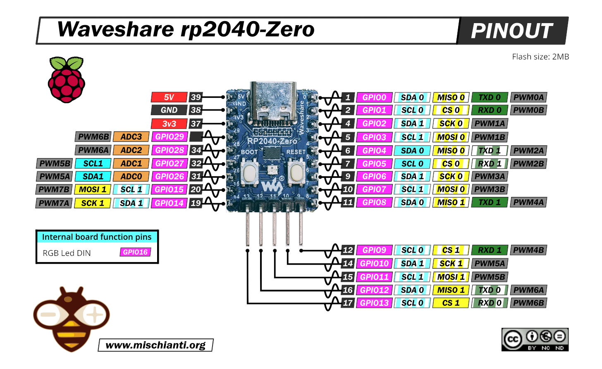

# pwm-converter

RC PWM (1000-2000us at 50Hz) to regular PWM duty cycle converter.

Example usage:
- Control brightness of LEDs on RC model via transmitter/radio channel.

Coded for and tested on [Waveshare RP2040 Zero](https://www.waveshare.com/wiki/RP2040-Zero) board.  
Compiles and flashes to the board with [TinyGo](https://tinygo.org).

Usage:
- 5v, GND and GP29 from receiver, GP29 being signal wire that brings RC PWM to the board;
- GP28 as "+" and GP27 as "-" to LED.

